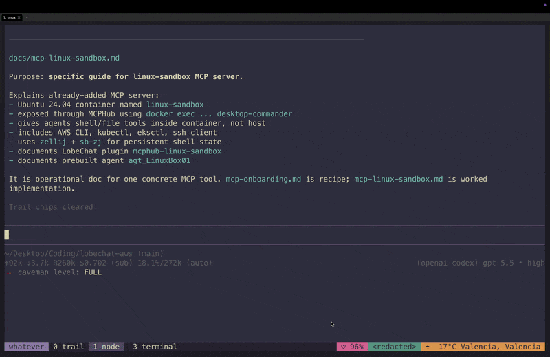
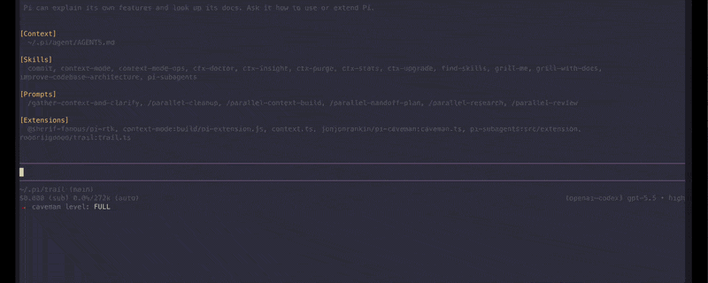
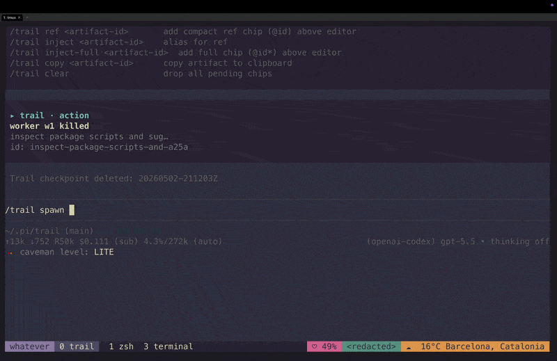

<p align="center">
  
</p>

# trail for pi

a review queue for agent work in pi.

an agent session produces lots of intermediate noise and a handful of things that actually need your judgment: a worker came back with three recommendations, a patch is sitting unreviewed, a command failed in a way that matters, a worker is blocked waiting for you. trail captures those moments as decision cards and ignores the rest.

trail is not a transcript browser, not a memory store, not a task manager. it is the place you look between turns to find out **what needs you next**, and then act on it without scrolling.

## the loop

```
  spawn / ask          capture            review                 act
  /trail spawn   →  artifacts +     →  /trail (inbox)   →   Enter   continue
  /trail            status.json        decision cards       c       reply
                                                            Space   dismiss
                                                            a       attach
                                                            /trail checkpoint
                                                                    delegate
```

four verbs, in order:

1. **spawn or ask** — `/trail spawn <task>` runs a background pi worker in tmux. or just keep working in the current session; trail captures along the way.
2. **capture** — file edits, failed commands, errors, worker results, checkpoints get snapshotted automatically. nothing enters model context until you say so.
3. **review** — `/trail` opens an opinionated inbox. only the things that need a decision show up.
4. **act** — `Enter` opens the answer, `c` continues with the worker, `Space` dismisses, `a` attaches the result to your next prompt, `/trail checkpoint` packages everything into a fresh session.

trail has some other commands such as `/trail log`, `/trail workers`, `/trail search`, `/trail load`, but that is the core. everything else should support the four verbs above. 

## why i made this

some of the situations that pushed it into existence:

- a worker finished with three useful recommendations and i had to skim a transcript to find them.
- a command failed in a way that mattered, and i lost it under the next twenty successful commands.
- i wanted to switch models or start a fresh session without re-typing the dead ends i had already ruled out.
- i had three workers running in parallel and could not see at a glance which one was waiting on me.
- i wanted to hand off a debugging session to my future self, with the failed paths included.

claude code's `/compact` was a starting reference. trail is the opposite move: instead of compressing the conversation, it pulls out the few decisions hiding inside it.

## quickstart (60 seconds)

install:

```bash
pi install git:github.com/roodriigoooo/trail
```

open the inbox in an active session:

```bash
/trail
```

spawn a background worker:

```bash
/trail spawn inspect the auth middleware token expiry edge case
```

that is the loop. wait for the worker, press `/trail` again, review the card, press `c` to continue or `a` to attach the result. the rest of this readme is reference.

## trail in motion

<p align="center">
  
</p>

<p align="center">
  
</p>

<p align="center">
  
</p>

## what enters the inbox

trail is opinionated about what surfaces. an item must belong to one of these categories or it stays out:

- **needs decision** — a worker called `trail_wait` and is paused for your reply.
- **ready for review** — a worker called `trail_done`; an assistant answer worth a second look.
- **patch proposed** — a worker edited files; you have not reviewed them yet.
- **failed / blocked** — a worker called `trail_fail`; an error artifact; a non-zero command in the current session.
- **checkpoint available** — a checkpoint was created and is ready to continue from.

category headers carry semantic color: amber for things asking for your attention, green for things waiting to be approved, red for things blocked.

## what does *not* enter the inbox

curation is half the product. these stay out by design:

- bare assistant file edits in the current session. they live in `/trail log`, not the inbox.
- successful commands. those are evidence, not decisions.
- intermediate worker chatter, reads, greps. those are part of an episode in the log.
- prompts you typed yourself. not actionable; you typed them.
- artifacts you already marked done with `Space`.

if everything entered the inbox, the inbox would be a transcript. it is not.

## decision card anatomy

selected inbox row expands into a card, not a longer log line:

```
▸ Worker w1 finished — README improvements review        [ready]

  • short workflow-oriented table of contents
  • fewer commands in README
  • GIFs for core flows

  [Enter Review answer]  [c Continue]  [a Attach]  [y Copy]  [Space Done]
  worker w1 · 31s ago · @status
```

- bold headline = what happened, in plain english.
- chip = current state (`ready`, `needs reply`, `failed`, `changed`).
- bullets = parsed from the worker's summary `Recommended:` block, verbatim.
- bracketed action row = the few keys that actually apply to this card.
- faint footer = provenance, metadata, artifact id. secondary.

primary text is cream; status carries color; metadata is muted. nothing competes.

## workers: the asking half of the loop

`/trail spawn [--worktree|-w] <task>` launches a pi worker in its own tmux session. it reads the task from `task.md`, snapshots its work to `artifacts.json`, and reports state via a small protocol.

while workers are running, a compact dock above the prompt shows one row per worker:

```
trail · feat/foo ±2 · 1 waiting · 2 ready
●  w1  ready          improve readme         3 recs · 1 file changed · 4/4 todos
●  w2  needs reply    audit migration order  needs reply
●  w3  failed         apply migration        error
```

`/trail workers` opens the focused worker dashboard. `/trail w<N>` expands a structured mini-report for one worker:

```
trail · w1 · ready  Reviewed README for command accuracy
  Task: Improve main README
  Progress: 4/4 todos complete
  Changes: none

  Outcome
    Suggested README improvements focused on command accuracy, onboarding,
    and navigation.

  Recommendations
    1. Sync README commands with current behavior
    2. Add a short quickstart near the top
    3. Add a compact workflow-oriented table of contents

  Useful references
    @w1.r24/answer  ToC recommendation
    @w1.c25/code    Markdown code block
```

worker artifacts cost **zero model-context bytes** until you explicitly attach one. there is no auto-injection.

### worker protocol (deterministic)

workers run with a `<trail_worker_guardrails>` block appended to their system prompt every turn. the contract is the single source of truth and lives in [`extensions/worker-guardrails.md`](./extensions/worker-guardrails.md). cheat sheet:

| tool | when to call |
|---|---|
| `trail_todos` | multi-step work (3–8 ordered items). replaces the visible board each call. |
| `trail_wait` | ambiguity that changes output, irreversible op not authorized in task, auth wall, contradiction in task. *do not assume.* |
| `trail_done` | finished, output useful. summary in prose + `Recommended:` bullets surfaced verbatim in the parent's card. |
| `trail_fail` | cannot continue, no useful partial output. one-sentence reason. |

override the file via `worker.guardrailsPath` in `~/.pi/agent/trail.json` or `<project>/.pi/trail.json`.

workers default to read-only investigation. `/trail spawn --worktree <task>` isolates the worker in a detached git worktree so it can edit freely without touching your branch. deleting the worker removes the worktree. trail does not auto-merge; you inspect and apply.

if the worker accidentally calls `/trail wait …` via bash, trail intercepts and records the intent. the tool path is still the contract.

## delegate: handoff checkpoints

when context is getting noisy or you want a fresh session with only the useful state:

```bash
/trail checkpoint --handoff finish the checkpoint store refactor
/trail continue last
```

checkpoint modes pick which artifacts to include automatically:

| mode | picks | use for |
|---|---|---|
| `--handoff` | decisions, files changed, dead ends, next steps | passing work to a new session or another model |
| `--compact` | minimal recent state | compressing without losing the key references |
| `--debug` | errors, failed commands, repro steps | reproducing a bug in a clean session |
| `--review` | files changed, code blocks, commands | walking a reviewer through what happened |

flags:

- `--once` — checkpoint is soft-consumed after first `/trail continue` or `/trail load`. recoverable for `consumedRetentionDays` (default 7). `/trail unload <id>` cancels the consume contract.
- `--raw` — skip the model summarizer, keep artifact excerpts as written.
- `--model <provider/model>` — summarize with a specific model.
- `--max-output <tokens>` — cap the summary length.

the checkpoint is plain markdown plus a sidecar `artifacts.json`. you can edit it before continuing.

## audit: /trail log

`/trail log` is the forensic view. episodes (one per worker, plus current session) grouped together with their child artifacts:

```
Worker w1 · README review · 6 items
   f  read README.md                   12m ago  @f1
   f  edit README.md                   11m ago  @f2
   $  npm test                          9m ago  @c1
   ✦  trail_done summary                8m ago  @r1

Current session · 12 items
   f  read extensions/trail.ts          5m ago  @f10
   ...
```

use this when you are reconstructing what happened, not when you are deciding what to do next. for the latter, you want `/trail` (the inbox).

## commands

primary:

- `/trail` — open the inbox.
- `/trail spawn [--worktree|-w] <task>` — launch a background worker.
- `/trail tell w<N> [text]` — reply to a worker. omit text to open an input prompt.
- `/trail w<N>` — show the worker mini-report above the prompt.
- `/trail use w<N>` — attach the worker result to your next message.
- `/trail checkpoint [flags] [note]` — package a handoff for a fresh session.
- `/trail continue [id|last]` — start a fresh session from a checkpoint.

secondary:

- `/trail answers [query]` — narrow the inbox to answers.
- `/trail log` — audit timeline grouped by episode.
- `/trail search <query>` — ranked artifact search.
- `/trail workers` — focused worker dashboard.
- `/trail list [--include-consumed] [--workers]` — list checkpoints or workers.
- `/trail delete [id|last|w<N>]` — kill a worker or purge a checkpoint.

advanced (plumbing for power flows and scripting):

- `/trail load [id|last|w<N>] [--include-consumed]` — mount artifacts into the navigator without spending tokens.
- `/trail unload <id|w<N>|all>` — drop a loaded slot.
- `/trail ref <artifact-id-or-ref>` — attach a compact reference chip.
- `/trail inject <artifact-id-or-ref>` — alias for `ref`.
- `/trail inject-full <artifact-id-or-ref>` — attach full artifact text.
- `/trail copy <artifact-id-or-ref>` — copy to clipboard.
- `/trail wait` / `/trail done` / `/trail fail` — worker-side prompt fallbacks. the protocol tools are the contract; these are intercepted as a safety net.

short aliases: `/trail s <query>`, `/trail r [id|last]`, `/trail ckpt`, `/trail ask w<N>` (alias for `tell`).

## keys

`/trail` (inbox) footer follows a primary-action model — only the common keys appear; press `?` for the rest.

primary:

- `↑↓` / `j/k` — move
- `Enter` — review primary action (tell waiting worker, review diff, inspect failure, view answer, open file)
- `c` — continue (sends follow-up to selected worker; falls back to handoff checkpoint when nothing is worker-bound)
- `Space` — mark done / restore
- `a` — attach compact reference chip
- `y` — copy selected artifact
- `/` — search trail
- `s` — switch source (pills above the list always show available scopes)
- `tab` / `1` / `2` / `3` — cycle inbox → answers → log
- `?` — show advanced shortcuts
- `q` or `Esc` — close

advanced (revealed by `?`):

- `o` open file · `I` inject full chip · `p` pin · `v` preview · `f` cycle artifact kind · `t` tell (alias for `c`) · `x` done (alias for `Space`) · `g/G` top/bottom

`/trail workers`:

primary:

- `↑↓` / `j/k` — move
- `Enter` — open selected worker details
- `c` — continue/tell selected worker
- `a` — copy tmux attach command
- `l` — load selected worker refs
- `?` — show advanced shortcuts
- `q` or `Esc` — close

advanced (revealed by `?`):

- `tab` switch worker · `t` tell alias · `x` stop/delete worker (destructive)

inspect views (`Enter` from any row):

- `j/k` line · `J/K` 5 · `d/u` and `Ctrl+D/U` half-page · `Space`/`Ctrl+F`/`PageDown` page · `b`/`Ctrl+B`/`PageUp` page back · `g/G` top/bottom · `q` close

checkpoint resume (`/trail continue` with UI):

- `j/k` move · `Enter` continue · `p` preview · `e` edit then continue · `d` delete after confirm · `q` close

checkpoint review (`/trail checkpoint` with UI):

- `j/k` move · `Space` include/exclude · `a` include all · `n` include none · `Enter` create from selection · `q` cancel

checkpoint quality guidelines live in [docs/checkpoint-guidelines.md](./docs/checkpoint-guidelines.md).

## configuration

trail merges config from:

1. `~/.pi/agent/trail.json`
2. `<project>/.pi/trail.json`

example:

```json
{
  "maxArtifacts": 300,
  "maxBodyChars": 6000,
  "checkpointArtifacts": 24,
  "consumedRetentionDays": 7,
  "summarizer": {
    "enabled": true,
    "provider": "openai",
    "model": "gpt-5.2",
    "maxOutputTokens": 1200,
    "maxInputChars": 36000,
    "timeoutMs": 120000
  },
  "worker": {
    "guardrailsPath": "~/.pi/agent/trail/my-worker-rules.md"
  }
}
```

set `worker.guardrailsPath` to override the packaged worker contract with your own markdown file. absolute paths or paths relative to cwd both work. if unset, trail uses `extensions/worker-guardrails.md` shipped with the package.

## storage

checkpoints live in:

- `~/.pi/agent/trail/checkpoints/<id>.md`
- `~/.pi/agent/trail/checkpoints/<id>.artifacts.json`
- `~/.pi/agent/trail/index.json`
- `~/.pi/agent/trail/events.ndjson`

workers live in:

- `~/.pi/agent/trail/workers/<id>/task.md`
- `~/.pi/agent/trail/workers/<id>/status.json`
- `~/.pi/agent/trail/workers/<id>/artifacts.json`

checkpoint state is event-backed (`events.ndjson`) with a legacy `index.json` snapshot for compatibility. worker artifact snapshots are refreshed by the worker session heartbeat and mounted into the parent session as source slots like `w1`, `w2`, etc.

`--once` checkpoints are soft-consumed at the end of the session that used them. the index entry is marked `consumedAt`, hidden from default listings, and the underlying files stay on disk for `consumedRetentionDays` (default 7) so an accidental cancel is recoverable. `/trail unload <id>` cancels the pending consume contract. `/trail delete` always purges immediately. pass `--include-consumed` to `list` / `load` to see soft-consumed entries.

file-path references inside an injected checkpoint always survive consume — they point to your project's disk paths, not trail storage. only artifact-level lookups (`/trail ref c1.f12`, etc.) require the original `artifacts.json` to still exist; `/trail load` rehydrates them from the sidecar without spending any model-context tokens.

worker artifacts are similar carryover sources, but they come from `workers/<id>/artifacts.json`. `/trail load w<N>` mounts them into the navigator; `/trail delete w<N>` kills/purges the worker; `/trail unload w<N>` only removes the mounted source from the current session.

### example checkpoint markdown

`~/.pi/agent/trail/checkpoints/20260502-184212Z.md`

```md
# Trail checkpoint 20260502-184212Z

mode: handoff
summary: llm
cwd: /Users/me/project
created: 2026-05-02T18:42:12.000Z
note: finish checkpoint store refactor
artifacts: /Users/me/.pi/agent/trail/checkpoints/20260502-184212Z.artifacts.json

## Summary
Checkpoint store now writes durable markdown plus sidecar artifact JSON.

## Decisions / constraints
- Keep checkpoints compact; do not preserve full transcript.
- Store exact artifact refs so fresh sessions can ask for source context.

## Current state
- `extensions/checkpoint-store.ts` handles save, list, find, read, consume.
- `--once` checkpoints are soft-consumed after use; markdown and sidecar artifacts are retained until the consumed retention window expires.

## Next steps
- Add tests for partial checkpoint id lookup.
- Run `npm run check`.

## Avoid repeating
- Do not move checkpoint files into project cwd; storage belongs under Pi agent dir.

## References
- [file:f12] `extensions/checkpoint-store.ts`
- [command:c4] `npm run check`
```

### example checkpoint artifacts

`~/.pi/agent/trail/checkpoints/20260502-184212Z.artifacts.json`

```json
[
  {
    "id": "f12",
    "displayId": "f12",
    "ref": "file:abc123:0",
    "kind": "file",
    "title": "edit extensions/checkpoint-store.ts",
    "subtitle": "+ save checkpoint markdown and sidecar artifacts",
    "body": "export function createCheckpointStore(): CheckpointStore { ... }",
    "timestamp": 1777747332000,
    "meta": {
      "path": "extensions/checkpoint-store.ts"
    }
  },
  {
    "id": "c4",
    "displayId": "c4",
    "ref": "command:def456:0",
    "kind": "command",
    "title": "npm run check",
    "subtitle": "exit 0",
    "body": "tsc --noEmit"
  }
]
```

## trail vs `/compact`

claude code's `/compact` and trail solve different halves of the same problem. `/compact` compresses the conversation. trail extracts the decisions.

| feature | `/compact` | trail |
|---|---|---|
| compress current conversation | yes | yes, optionally |
| review what needs your decision next | no | yes (inbox + cards) |
| select exact artifacts to preserve | limited | yes |
| preserve exact commands/errors/files | not guaranteed | yes |
| save durable checkpoints | not the main model | yes |
| resume in another session/model/tool | limited | yes |
| edit handoff before reuse | not the core workflow | yes |
| track dead ends / already tried | not guaranteed | yes |
| run parallel background investigations | no | yes (`/trail spawn`) |

## install

from github while trail is moving fast:

```bash
pi install git:github.com/roodriigoooo/trail
```

pinned github release:

```bash
pi install git:github.com/roodriigoooo/trail#v0.2.0
```

from npm:

```bash
pi install npm:@roodriigoooo/trail
```

if `/trail spawn` or `/trail workers` is unknown, you are running an older installed trail. install/pin current trail or run this repo locally with `pi --no-extensions -e ./extensions/trail.ts`.

## development

run from repo without installing:

```bash
pi --no-extensions -e ./extensions/trail.ts
```

smoke test:

```bash
pi --no-extensions -e ./extensions/trail.ts --mode json --no-session "/trail help"
```

type check:

```bash
npm ci
npm run check
```

run tests:

```bash
npm test
```

dry-run package contents:

```bash
npm run pack:dry
```

## security

pi extensions run with full system permissions. review source before installing third-party packages.
