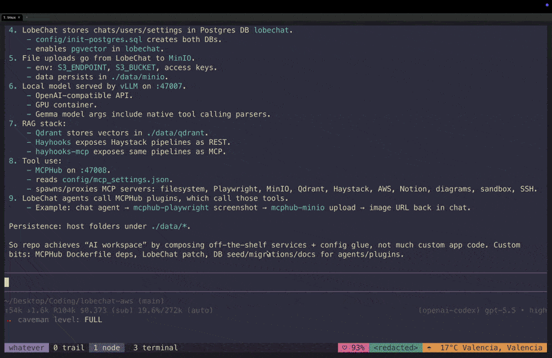

<p align="center">
  
</p>

# trail for pi

this is a little pi extension for keeping track of the useful things that happen during a coding session.

my goal is to make session context less magical and less lossy. when i am working with an agent, i often want to grab the one command that worked, the file that was just edited, the short list of errors i already hit, or the decision that finally made the implementation click. i do not always want the whole conversation. i want the trail.

Trail turns commands, errors, file operations, code blocks, prompts, responses, and checkpoints into things you can browse, inspect, copy, reference, and package into a handoff for a fresh session.

it is not meant to be history search. it is more like a small artifact navigator and checkpoint tool for agent work.

## why i made this

some of the situations that inspired it:

- wanting to see a created or edited file one more time without digging through the transcript
- wanting a short list of errors triggered during the session
- wanting to find that one command that worked, and not rerun the five that did not
- wanting to carry only the useful state into a new session
- wanting to hand off a debugging session with the dead ends included
- wanting to package a review, repro, or compact continuation note before context gets too noisy
- wanting to switch models or start fresh without losing the actual work trail

Claude Code's `/compact` was also a big inspiration. unlike `/compact`, which compresses the current conversation, Trail lets users navigate, select, verify, and package the exact commands, errors, files, decisions, dead ends, and next steps needed to continue work in a fresh session.

| Feature | `/compact` | Trail |
| --- | --- | --- |
| Compress current conversation | Yes | Yes, optionally |
| Navigate session artifacts | Limited | Yes |
| Select exact artifacts to preserve | Limited | Yes |
| Preserve exact commands/errors/files | Not guaranteed | Yes |
| Save durable checkpoints | Not the main model | Yes |
| Resume in another session/model/tool | Limited | Yes |
| Edit handoff before reuse | Not the core workflow | Yes |
| Track dead ends / already tried | Not guaranteed | Yes |
| Create debug/review/repro handoffs | No | Yes |

## install

from GitHub while Trail is moving fast:

```bash
pi install git:github.com/roodriigoooo/trail
```

pinned GitHub release:

```bash
pi install git:github.com/roodriigoooo/trail@v0.1.3
```

from npm:

```bash
pi install npm:@roodriigoooo/trail
```

## example usage

open the artifact navigator:

```bash
/trail
```

search the current session artifacts:

```bash
/trail search migration failed
```

search returns ranked artifacts, not raw grep lines. Trail favours errors, files, and commands before transcript-like matches.

create a handoff checkpoint:

```bash
/trail checkpoint --handoff finish the checkpoint store refactor
```

create a one-time debug checkpoint that deletes itself after resume:

```bash
/trail checkpoint --debug --once --raw investigate failing ci
```

continue from the latest checkpoint in a fresh session:

```bash
/trail continue last
```

## examples to get the idea across

### Trail in motion

<p align="center">
  
</p>

<p align="center">
  
</p>

<p align="center">
  
</p>

## commands

- `/trail` — open artifact navigator
- `/trail search <query>` — search ranked artifact docs, then browse matches
- `/trail checkpoint [--handoff|--compact|--debug|--review] [--once] [--raw] [--model <provider/model>] [--max-output <tokens>] [--] [note]` — review selected artifacts, then create editable summarized checkpoint
- `/trail continue [id|last]` — choose or start from a checkpoint in a fresh session
- `/trail resume [id|last]` — alias for continue
- `/trail delete [id|last]` — choose or delete a checkpoint
- `/trail list` — list checkpoints
- `/trail ref <artifact-id-or-ref>` — inject compact artifact reference
- `/trail inject <artifact-id-or-ref>` — alias for `ref`
- `/trail inject-full <artifact-id-or-ref>` — inject full artifact text
- `/trail copy <artifact-id-or-ref>` — copy artifact to clipboard

## checkpoint resume keys

When UI is available, `/trail continue` shows saved checkpoints:

- `j/k` or arrows — move
- `enter` — continue from selected checkpoint
- `p` — preview checkpoint markdown
- `e` — edit then continue
- `d` — delete selected checkpoint after confirmation
- `q` or `esc` — close

## checkpoint review keys

When UI is available, `/trail checkpoint` shows mode-selected artifacts before drafting:

- `j/k` or arrows — move
- `space` — include/exclude artifact
- `a` — include all
- `n` — include none
- `enter` — create checkpoint from checked artifacts
- `q` or `esc` — cancel

Checkpoint quality guidelines live in [docs/checkpoint-guidelines.md](./docs/checkpoint-guidelines.md).

## navigator keys

- `j/k` or arrows — move
- `g/G` — top/bottom
- `tab` — cycle artifact type
- `enter` — inspect selected artifact; file artifacts open current full file contents
- `i` or `r` — inject compact artifact reference
- `I` — inject full artifact text
- `y` — copy selected artifact
- `c` — create handoff checkpoint
- `v` — toggle detail
- `q` or `esc` — close

## configuration

Trail merges config from:

1. `~/.pi/agent/trail.json`
2. `<project>/.pi/trail.json`

example:

```json
{
  "maxArtifacts": 300,
  "maxBodyChars": 6000,
  "checkpointArtifacts": 24,
  "summarizer": {
    "enabled": true,
    "provider": "openai",
    "model": "gpt-5.2",
    "maxOutputTokens": 1200,
    "maxInputChars": 36000,
    "timeoutMs": 120000
  }
}
```

## storage

checkpoints live in:

- `~/.pi/agent/trail/checkpoints/<id>.md`
- `~/.pi/agent/trail/checkpoints/<id>.artifacts.json`
- `~/.pi/agent/trail/index.json`

`--once` checkpoints are deleted from disk and index after successful `/trail continue` / `/trail resume`.

### example checkpoint markdown

`~/.pi/agent/trail/checkpoints/20260502-184212Z.md`

```md
# Trail checkpoint 20260502-184212Z

mode: handoff
summary: llm
cwd: /Users/me/project
created: 2026-05-02T18:42:12.000Z
note: finish checkpoint store refactor
artifacts: /Users/me/.pi/agent/trail/checkpoints/20260502-184212Z.artifacts.json

## Summary
Checkpoint store now writes durable markdown plus sidecar artifact JSON.

## Decisions / constraints
- Keep checkpoints compact; do not preserve full transcript.
- Store exact artifact refs so fresh sessions can ask for source context.

## Current state
- `extensions/checkpoint-store.ts` handles save, list, find, read, consume.
- `--once` checkpoints remove markdown, sidecar JSON, and index entry after resume.

## Next steps
- Add tests for partial checkpoint id lookup.
- Run `npm run check`.

## Avoid repeating
- Do not move checkpoint files into project cwd; storage belongs under Pi agent dir.

## References
- [file:f12] `extensions/checkpoint-store.ts`
- [command:c4] `npm run check`
```

### example checkpoint artifacts

`~/.pi/agent/trail/checkpoints/20260502-184212Z.artifacts.json`

```json
[
  {
    "id": "f12",
    "displayId": "f12",
    "ref": "file:abc123:0",
    "kind": "file",
    "title": "edit extensions/checkpoint-store.ts",
    "subtitle": "+ save checkpoint markdown and sidecar artifacts",
    "body": "export function createCheckpointStore(): CheckpointStore { ... }",
    "timestamp": 1777747332000,
    "meta": {
      "path": "extensions/checkpoint-store.ts"
    }
  },
  {
    "id": "c4",
    "displayId": "c4",
    "ref": "command:def456:0",
    "kind": "command",
    "title": "npm run check",
    "subtitle": "exit 0",
    "body": "tsc --noEmit",
    "timestamp": 1777747390000
  }
]
```

### example checkpoint index

`~/.pi/agent/trail/index.json`

```json
[
  {
    "id": "20260502-184212Z",
    "mode": "handoff",
    "file": "/Users/me/.pi/agent/trail/checkpoints/20260502-184212Z.md",
    "createdAt": "2026-05-02T18:42:12.000Z",
    "cwd": "/Users/me/project",
    "sourceSession": "/Users/me/.pi/sessions/project/session.jsonl",
    "note": "finish checkpoint store refactor",
    "consumeOnUse": false
  }
]
```

## development

run from repo without installing:

```bash
pi --no-extensions -e ./extensions/trail.ts
```

smoke test:

```bash
pi --no-extensions -e ./extensions/trail.ts --mode json --no-session "/trail help"
```

type check:

```bash
npm ci
npm run check
```

dry-run package contents:

```bash
npm run pack:dry
```
## security

Pi extensions run with full system permissions. review source before installing third-party packages.
