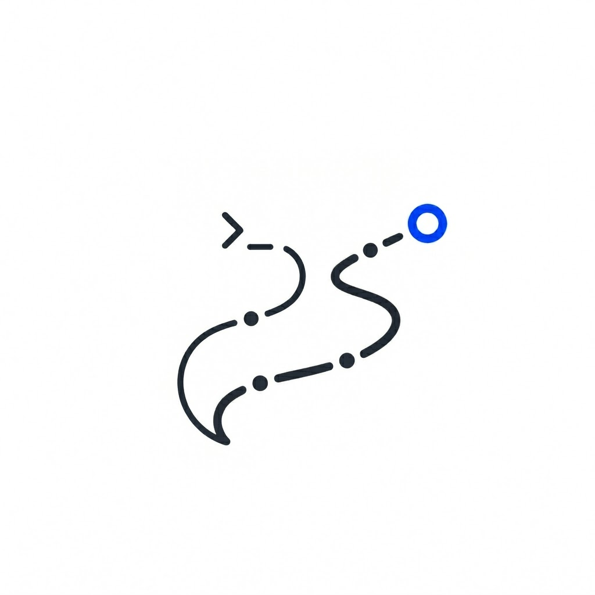

<p align="center">
  
</p>

<p align="center">
  <a href="https://www.npmjs.com/package/@roodriigoooo/pi-docket"></a>
</p>

# pi-docket full reference

> This page keeps the longer README content from earlier releases. The root README is now shorter and more product-focused.

Docket is a decision queue for work done inside pi.

It pulls the few moments that need human judgment out of long agent work: worker findings, proposed patches, failed commands, saved evidence bundles, and questions. It is not a transcript browser, not a memory system, and not a task manager. Docket keeps evidence available and asks: **what needs a decision now?**

> Formerly `trail`. The rename is intentional: the product is no longer framed as a history trail or session-resume system. Docket is a docket of cases needing judgment, with evidence bundles attached.

## Core philosophy

- **Pi owns sessions.** Use pi's `/tree`, `/fork`, `/clone`, `/compact`, `/new`, and `/resume` for conversation topology and context-window management.
- **Docket owns decisions.** It ranks artifacts into review items, shows cards, and keeps evidence out of model context until you attach it.
- **tmux owns parallel visibility.** Workers are visible pi processes in one shared tmux session. You can attach and inspect them directly.
- **Workers are explicit.** Docket may eventually suggest a worker only when context-heavy work is obvious and maps to a known worker kind. It must never silently spawn.

## Install

```bash
pi install git:github.com/roodriigoooo/pi-docket
```

Open Docket:

```bash
/docket
```

Spawn a worker explicitly:

```bash
/docket spawn --as scout map callers of getUser()
```

Save evidence as a zero-token bundle:

```bash
/docket save auth investigation findings
```

Load a bundle or worker artifacts:

```bash
/docket load last
/docket load w1
```

## Rename from Trail

This release is a breaking rename.

- Package: `@roodriigoooo/pi-docket`
- GitHub repo title: `pi-docket`
- Slash command: `/docket`
- Old `/trail` commands are not kept as aliases.
- Worker protocol tools are now `docket_wait`, `docket_done`, `docket_fail`, `docket_todos`, and `docket_spawn_child`.
- Storage/config paths now use `docket`:
  - `~/.pi/agent/docket/`
  - `~/.pi/agent/docket.json`
  - `<project>/.pi/docket.json`
  - `<project>/.pi/docket/worker-kinds/*.md`

If you need old data, copy it manually before deleting the old package:

```bash
cp -R ~/.pi/agent/trail ~/.pi/agent/docket
cp ~/.pi/agent/trail.json ~/.pi/agent/docket.json 2>/dev/null || true
cp -R .pi/trail .pi/docket 2>/dev/null || true
cp .pi/trail.json .pi/docket.json 2>/dev/null || true
```

## Basic loop

```text
  work / spawn       capture             decide                act
  current pi    ->   artifacts       ->  /docket cards   ->   Enter review
  /docket spawn      status.json         evidence             r reply · b save
                                      bundles/workers         a attach ref
```

1. **Work or spawn** — keep working in the parent session, or explicitly start a background worker with `/docket spawn`.
2. **Capture** — Docket records failed commands, file changes, worker results, saved bundles, and questions.
3. **Decide** — `/docket` opens only items that likely need attention.
4. **Act** — review, reply, promote, dismiss, attach evidence, save/load bundles, or attach to tmux.

## Commands

Primary commands:

| Command | Purpose |
|---|---|
| `/docket` | Open decision docket. |
| `/docket verdict [w<N>]` | Resolve the top worker decision (accept/reject/chat). |
| `/docket spawn [--fresh] [--as <kind>] <task>` | Start explicit background worker. |
| `/docket tell w<N> [text]` | Reply to worker. Multiline text is pasted intact. |
| `/docket attach [w<N>]` | Switch to the shared worker tmux session when already in tmux; otherwise copy attach command. |
| `/docket save [flags] [note]` | Save selected evidence as bundle and label current pi tree leaf. |
| `/docket load [id\|last\|w<N>]` | Mount bundle or worker artifacts at zero model-context cost. |

Advanced commands:

| Command | Purpose |
|---|---|
| `/docket workers [--all]` | Worker dashboard. |
| `/docket kinds` | List worker kinds. |
| `/docket respawn <w<N>\|all>` | Relaunch worker whose tmux window died. |
| `/docket answers [query]` | Browse assistant/worker answers. |
| `/docket log` | Audit timeline grouped by episode. |
| `/docket log decisions` | Verdict ledger plus workers evicted unreviewed. |
| `/docket search <query>` | Ranked artifact search. |
| `/docket list [--include-consumed] [--workers\|--all]` | List saved bundles or workers. |
| `/docket unload <id\|w<N>\|all>` | Drop mounted bundle/worker artifacts. |
| `/docket delete [id\|last\|w<N>]` | Delete bundle or worker. Worker delete cascades to children. |
| `/docket ref <artifact-id>` | Attach compact artifact reference to next prompt. |
| `/docket inject-full <artifact-id>` | Attach full artifact text to next prompt. |
| `/docket copy <artifact-id>` | Copy artifact text. |
| `/docket clear` | Drop pending chips/widgets. |

No short aliases are intentionally provided. Fewer commands, clearer intent. `workers` is the fleet/operator dashboard; `answers` is only an advanced response-artifact lens, not a second worker dashboard.

Docket slash commands are Pi extension commands, so Pi executes them immediately even while an agent turn is streaming. Use them for parent-side operations like spawn, load, unload, delete, attach/switch, and dashboard inspection; natural-language prompts still follow Pi's normal steer/follow-up queue.

## The review surface

`/docket` opens the inbox as an overlay. On a wide terminal (roughly 120 columns and up) it splits into two panes: the list of review items on the left, and the selected item's card plus an evidence preview on the right. Move with `j`/`k` and the preview follows. On narrower terminals the card renders below the list, same as before.

```text
 Failed / blocked · 2                      │ TypeError: boom in auth.ts [error]
▸  TypeError: boom in auth.ts  [error]     │ [Enter Inspect] [a Attach] [y Copy]
   Command failed: npm test   [error]      │ current session · 2m ago · @e1
                                           │ ····································
                                           │ at verifyToken (src/auth.ts:42)
                                           │ at middleware (src/app.ts:10)
```

The preview is read from disk. Browsing costs zero model context; attaching still requires an explicit `a` (compact ref) or `I` (full text). Reply to a worker with `r`, save a bundle with `b`, copy with `y`, mark done with `Space`. Press `?` for the full key list.

## The verdict card

`/docket verdict` (or `Enter` on a worker row) opens one decision at a time. It reads only status fields and the deterministic change set, never the transcript, so it costs zero model context. Resolve it from the verb menu, or, when a blocked worker proposes options, press `1`..`9` to pick one directly:

```text
 docket · verdict                                        Esc close
 ● w3 · run migration suite   needs input · 1m ago
   ⚠ irreversible: drops the sessions table

 ▸ 1 Use the migration-safe path        · recommended
   2 Proceed as proposed
   Steer          something else · stays alive

   Reject & stop  kill worker + remove workspace
   Chat           type a reply
 1-2 pick · ↑↓ move · Enter select · Esc close
```

`Reject & stop` is set apart with a blank line and warning color because it kills the worker and removes its workspace, and it always asks for confirmation. Number keys only reach the offered options, never the destructive verb.

## Decision ledger

Every verdict you resolve (accept, reject, reject & stop, chat, or an option-send) is appended to `~/.pi/agent/docket/decisions.ndjson` with the verb, the option text, any risk the worker flagged, and the evidence refs that were on the card. `/docket log decisions` (short: `/docket decisions`) renders it:

```text
Decisions · last 7 days
  6 resolved · 2 evicted unreviewed
  accept 3 · reject 2 · reject & stop 1
  decision debt: 2 workers evicted unreviewed this week

Recent (8 of 8):
  3m ago   w3  option "Use the migration-safe path"  (needs_input)  ⚠ irreversible: drops the sessions table
  1h ago   w1  accept  (ready)  [worker-changeset:auth-bug-a3b1:0]
  2h ago   w2  evicted unreviewed (ended) · refactor token cache
```

The last line is decision debt: a worker reached a terminal state and was pruned with no verdict ever recorded, so it aged out before anyone looked. Counting it keeps automation bias visible rather than silent.

## Evidence bundles

A Docket bundle is a frozen artifact sidecar plus a small orientation markdown file. It is not a model-written summary by default.

`/docket save`:

- selects relevant artifacts,
- lets you prune/edit the bundle header,
- writes `<id>.md` + `<id>.artifacts.json`,
- labels the current pi session tree leaf as `docket:<id>`.

`/docket load` mounts bundle artifacts into the current session's Docket navigator at zero model-context cost. Nothing enters the model prompt until you explicitly attach a compact ref or full artifact. Loading a worker marks it `loaded` in the dock: visible, but no longer counted as unresolved review work.

This deliberately complements pi:

- use `/tree` to move conversation state,
- use `/fork` or `/clone` to split sessions,
- use `/compact` for lossy summary,
- use `/docket save` for durable evidence,
- use `/docket load` when that evidence becomes relevant.

## Workers

`/docket spawn <task>` starts a background pi worker as one window in a shared tmux session named `docket-workers`.

Workers have:

- hidden workspace, often a detached git worktree,
- task file,
- `status.json`,
- `artifacts.json`,
- append-only `events.ndjson`,
- protocol tools for parent communication.

Worker artifacts never enter model context automatically except for the short ready summary, if enabled. Full evidence stays on disk until loaded or attached. Loading a ready worker marks it `loaded` in the dock; that is an attention-state change, not an accept verdict.

Each worker gets a small pre-flight brief in `task.md`: kind, workspace, decision rights, and any plan gate. A plan gate means the worker can do read-only discovery, then must call `docket_wait` with its plan before the first edit or mutating command. The bundled `patcher` kind uses this by default.

When two workers edit the same path, Docket surfaces an `overlap w<N>: <path>` hint in the dock/dashboard and asks for confirmation before promoting a conflicting change set. It does not lock files or auto-merge workers; the parent remains the mediator.

The dock also shows passive warnings. `silent 6m` means a running worker has not emitted a tool/todo event lately. `waiting 31m` means a parent question has aged. Docket does not auto-kill or auto-respawn for either warning. It tells you to peek, reply, reject, or stop.

### When a worker dies

If the worker process exits, Docket keeps the dead tmux pane around just long enough to capture its final terminal output, then cleans the window up. The capture is saved as `pane-tail.txt` in the worker directory, appears in review as a `terminal tail` artifact, and the failed verdict card prints the last few lines. A crashing worker tells you why it crashed, not just its exit code:

```text
w3 failed · run migration suite
  worker process exited before reporting ready (exit 1)

  terminal tail
  Error: missing DATABASE_URL
      at loadConfig (src/db.ts:14)
  Pane is dead (status 1, Fri Jun 13 00:15:59 2026)
```

### Worker kinds

Bundled kinds:

- `default`: general worker, edits allowed when task asks.
- `scout`: fast read-only recon.
- `patcher`: plan-gated edits in a worker worktree, then proposes a change set.

Examples:

```bash
/docket spawn --as scout find route handlers that touch auth cookies
/docket spawn --as patcher rename AccountService in src only
```

Custom kinds live in:

- `~/.pi/agent/docket/worker-kinds/*.md`
- `<project>/.pi/docket/worker-kinds/*.md`

See [docs/configuration.md](./configuration.md#worker-kinds).

### Worker protocol

Workers use tools, not shell commands:

| Tool | Purpose |
|---|---|
| `docket_todos` | Publish small progress board. Informational; `docket_done` is completion. |
| `docket_wait` | Ask parent for input and pause. |
| `docket_done` | Mark useful output ready for review. |
| `docket_fail` | Mark cannot continue with no useful partial output. |
| `docket_spawn_child` | Dispatch allowed child worker kind. |

Worker-side `/docket wait`, `/docket done`, and `/docket fail` are fallback prompt commands only.

For plan-gated work, the worker uses `docket_wait` as the gate. The verdict card shows the plan options and recommendation, then your choice is sent back as plain parent input.

## tmux

Docket uses tmux as the worker process and visibility layer, not as the decision log. Every worker is a normal pi process running in one window inside one shared session:

```bash
tmux attach -t docket-workers
```

`/docket attach` is deliberate terminal control. If Pi is already running inside tmux, Docket runs `tmux switch-client -t docket-workers` (or `docket-workers:w2`) so you move directly to the worker session. Outside tmux, it copies the equivalent `tmux attach` command. Attaching is for direct inspection or emergency debugging; normal coordination should go through `/docket tell`, `/docket verdict`, and the worker protocol tools.

### How Docket uses tmux

- **Spawn**: the first worker creates `docket-workers` with `new-session -d -s`; later workers use `new-window -d`. Windows are named `w<N>`, and Docket records tmux's stable `#{window_id}` (`@7`, `@8`, etc.) so renamed windows still resolve.
- **Reply**: one-line `/docket tell` uses `send-keys -l` plus a final `Enter`, so text is literal input and does not trigger tmux keybindings. Multiline replies use `load-buffer -` and `paste-buffer -p -d`, then `Enter`, so line breaks arrive as one pasted block. Shared-session payloads start with `[docket]` so worker input is recognizable.
- **Peek**: `/docket workers` uses `capture-pane -p` to render a bounded selected-worker pane snapshot inside the dashboard. It does not attach, focus the pane, or add anything to model context.
- **Post-mortem capture**: worker windows run with `remain-on-exit on`. If the worker process exits, Docket probes panes with `list-panes -F "#{pane_id} #{pane_dead}"`, captures the dead worker pane with `capture-pane`, writes `pane-tail.txt`, then kills the stale window. Split layouts are probed per pane because an event-tail helper pane may still be alive.
- **Optional tmux surfaces**: `layout: split-events` opens a detached split pane that tails `events.ndjson`; `worker.captureTerminal` uses `pipe-pane` to write terminal noise to `pane.log`; `worker.tmuxStatusLine` can write compact fleet status into the tmux status bar.

Silence warnings do not poll `capture-pane`. Docket reads the worker's `events.ndjson`; if nothing useful appears for a few minutes, the dock shows `silent Nm`. Use peek when you want scrollback. Use attach when you need full terminal control.

Rule of thumb: tmux handles live processes, scrollback, and direct visibility. Docket stores status, artifacts, verdicts, and decision debt on disk. Workers should not run write-side tmux commands themselves because the parent owns the shared session lifecycle.

### Peek without attaching

Most of the time you don't need full terminal control. In the workers dashboard (`/docket workers`), press `p` on a worker row to see the last lines of its live tmux pane rendered inside the dashboard. It refreshes about once a second, is strictly read-only, and costs zero model context. Use peek for "is it grinding or stuck on a prompt?" Use attach/switch only when you need to type in that terminal. Press `p` again or `Esc` to close.

## Development

Run from repo:

```bash
pi --no-extensions -e ./extensions/docket.ts
```

Smoke test:

```bash
npm run smoke:help
```

Type check:

```bash
npm run check
```

Tests:

```bash
npm test
```

Dry-run package:

```bash
npm run pack:dry
```
